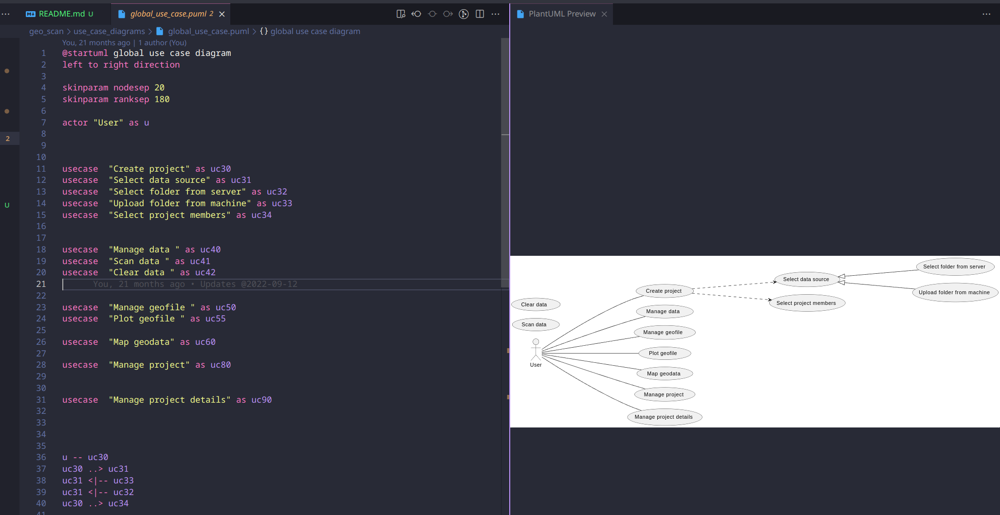
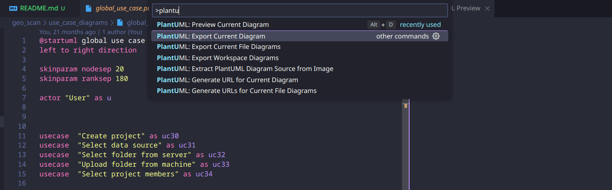

## About

UML Diagrams generated from code using [plant uml](https://plantuml.com/).
Because why not!

## Overview

Preview plant uml code 

    

Export diagram

    

## Setup

**Requirements**

Follow plant uml setup guide [here](https://plantuml.com/starting) 

**Tools**

- VSCode (or any other editor with plant uml extension).
- PlantUML extension `jebbs.plantuml` on vscode.

## Usage

- Open `geo_scan` folder
- Pick one of the `.puml` files
- Execute the preview command
- Refer to code and the preview to build the diagrams of your needs.
- Enjoy
